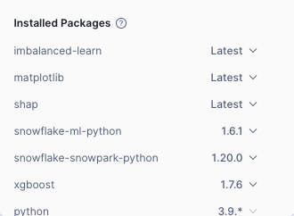

# HOL1: Credit Card Approval - MLOps Pipeline with Snowflake, Snowpark ML

This project demonstrates the setup, training, and inference of a credit risk prediction model using Snowflake, Snowpark, and machine learning libraries such as `XGBoost` and `SMOTE`. The pipeline automates both the training and inference process, triggered by changes in data.

## Key Features

- **Snowflake Integration:** ML model registry, Snowpark ML, feature store, stored procedures.
- **End-to-End Machine Learning Pipeline:** From data loading to model retraining based on performance metrics.

## Requirements

If you choose to run the python notebook in your vscode:

After cloning the repo, please open the `HOL1/` directory as the root directory in VS Code.

**Please make sure to use your own account instead of CAS1 or CAS2 to avoid modifying each other's objects.**

If you have no conda installed, please follow [this link]('https://docs.anaconda.com/anaconda/install/') to install Anaconda.

Install required Python packages by running:

```bash
conda create -n snowflake_mlops python=3.11
conda activate snowflake_mlops
pip install -r requirements.txt
```

## Execution Instructions

1. **Environment Setup**  
   - Open the project in your IDE (e.g., VSCode) with the Snowflake extension. Log into your Snowflake account.
   - Alternatively, logon to snowsight

   Do make sure to use your own account instead of CAS1 or CAS2 to avoid modifying each other's objects.

2. **Run SQL Scripts**  
   - Run [sql/1_setup_account.sql](sql/1_setup_account.sql) and [sql/2_setup_data.sql](sql/2_setup_data.sql) to set up the database and load data. You can run these either via your IDE's Snowflake add-on or in Snowsight. Note that if using Snowsight, you will need to upload the 4 data files to the stage.
   - At this stage, verify that there are 4 tables in `HOL1_DB.HOL1_SCHEMA`

3. **Run ML Pipeline**  
   - Option 1: Run [src/3_build_ML_pipeline_v_vscode.ipynb](src/3_build_ML_pipeline_v_vscode.ipynb) directly in VSCode or through opening up Jupyter Notebook in a web browser.
  
      - To set up the kernel in VS Code for your Python notebook:
         1. Open [src/3_build_ML_pipeline_v_vscode.ipynb](src/3_build_ML_pipeline_v_vscode.ipynb), in the top right corner, click on **Select Kernel**.
         2. From the list, choose **snowflake_mlops**.
         3. If **snowflake_mlops** is not listed, click on **Select Another Kernel**.
         4. Navigate to **Python Environments** and select **snowflake_mlops**.

   - Option 2: Upload [src/3_build_ML_pipeline_v_snowsight.ipynb](src/3_build_ML_pipeline_v_snowsight.ipynb) to Snowsight and run from there. Do make sure on top right corner, the right additional packages are imported as 
   
   This script defines the stored procedures for training and inference. Follow the instructions in the notebook step by step.

4. **Cleanup**  
   To clean up, run [4_clean_data.sql](sql/4_clean_data.sql) to remove temporary objects and stop any active tasks.